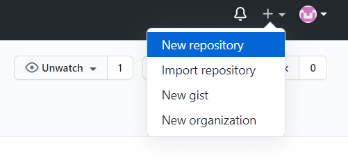
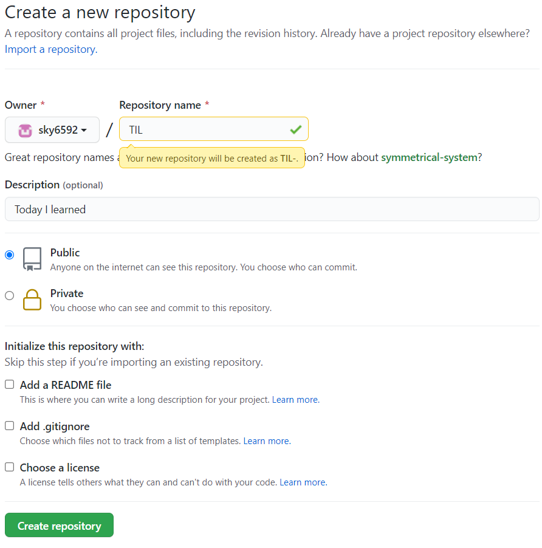

# git

> 1. github 원격저장소 작업
> 2. git 명령어


### github 원격저장소 작업

##### github repository 생성

1. github 계정생성
2.  repository 생성
   - md파일만 등록할 경우 **Intialize this repository with : 아무것도 체크하지 말기**





---


### git 명령어

> 윈도우 - git bash (리눅스 명령어로 진행함)
>
> 맥북 - terminal  (맥은 git이 자동으로 깔려있음)


##### git 이름과 아이디 연결

- 현재 등록되어있는 이름/이메일 확인
  - `config` : 설정하다

```bash
git config user.name
git config user.email
```


- 이름/이메일 등록 or 변경
  - `--global` 전역, 전세계, 현재 컴퓨터

```bash
git config --global user.name 이름
git config --global user.email 이메일
```


##### commit 내용 수정

- `--amend` 입력 후 → `esc`클릭 → 수정 → `shift`+`;` → `wq` → `enter`

```bash
git commit --amend
```


##### git 파일 이름 입력

* git bash에서 파일이름을 입력할때 오타가 많이 난다
  파일 앞글자 입력 후 `tab`을 누르게 되면 자동 입력 완성이 된다